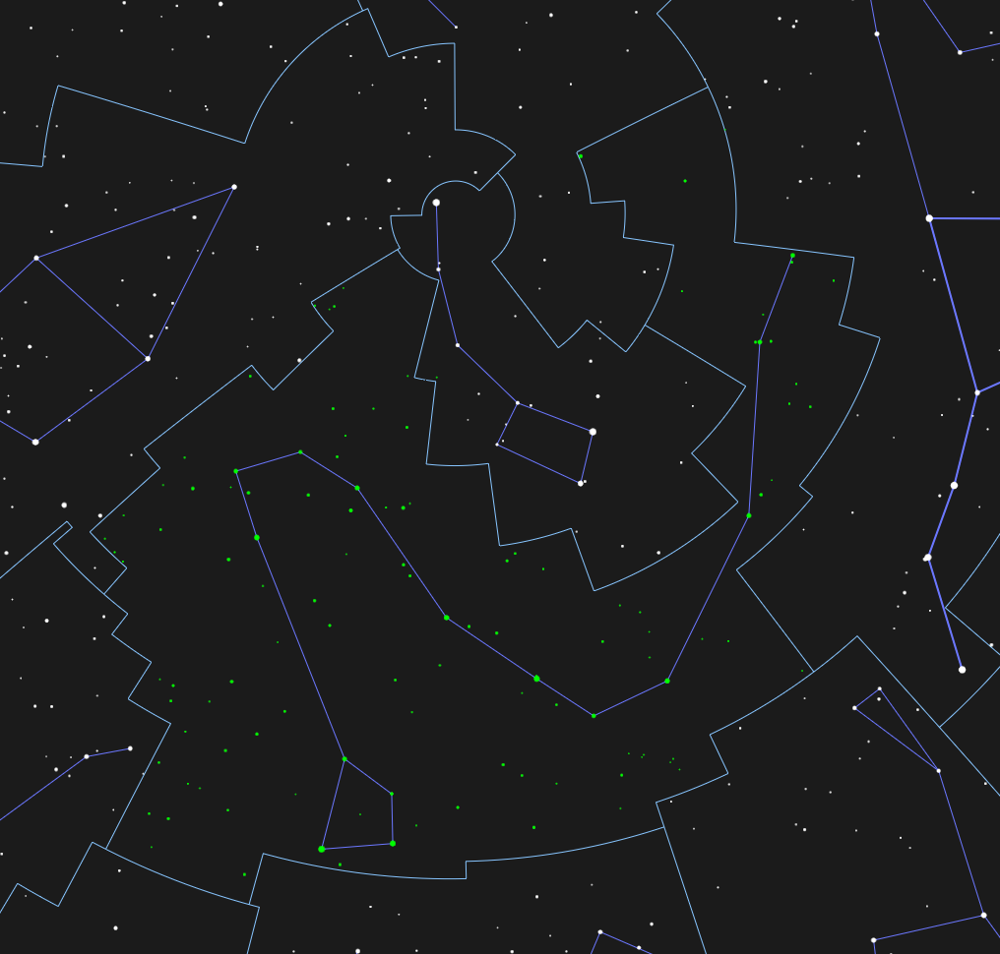

# Spherical Geometry
## Table of contents

- [Basic information](#basic-information)
- [Examples](#examples)
  - [Filtering stars by constellation](#filtering-stars-by-constellation)
  - [GeCAA theory task](#gecaa-theory-task)
- [Library state](#library-state)

## Basic information
A library for handling geometry on the surface of a sphere.

This library combines spherical and vector geometry to perform operations with points, [great circles](https://en.wikipedia.org/wiki/Great_circle), great circle arcs, and spherical polygons. A great circle is an equivalent of a straight line in planar geometry - it is the shortest path between two points on a sphere.

Doing geometry on a sphere requires using [spherical trigonometry](https://en.wikipedia.org/wiki/Spherical_trigonometry) and being very careful when taking `arcsin` etc. to get angles, as one often gets false results.

## Examples
More examples can be found in the `examples` folder. The unit tests can also serve as ones.
### Filtering stars by constellation
This uses the `Polygon` API, checking if each of the stars is inside the tested constellation polygon.

Testing all constellations on the sky, all of them worked without any issues (stars deemed to be inside the constellation are marked in green).

<details open>
  <summary>The constellation of Draco</summary>



</details>

<details>
  <summary>The constellation of Octans</summary>


</details>

<details>
  <summary>The constellation of Leo</summary>


</details>

### GeCAA theory task
Below is an example of solving the [GeCAA 2020 Theory task 7](https://gecaa.ee/wp-content/uploads/2020/10/GeCAA-Theoretical-solutions.pdf) analytically.
```rust
use spherical_geometry::{SphericalPoint, GreatCircle};
use std::f32::consts::PI;

fn gecaa_2020_theory_7() {
    let delta = 10e-2;

    let start_1 = SphericalPoint::new(-PI / 2.0, 0.0);
    let end_1 = SphericalPoint::new(0.0, 15.0 * PI / 180.0);
    let circle_1 = GreatCircle::new(start_1, end_1).expect("The points are fairly far away");

    let start_2 = SphericalPoint::new(-210.0 * PI / 180.0, 23.5 * PI / 180.0); // Switch RA direction as the question measures azimuth from north to east
    let end_2 = SphericalPoint::new(-255.0 * PI / 180.0, 75.0 * PI / 180.0); // Switch RA direction as the question measures azimuth from north to east
    let circle_2 = GreatCircle::new(start_2, end_2).expect("The points are fairly far away");

    let intersections = circle_1.intersect_great_circle(&circle_2).expect("The paths are not parallel");

    let [(ra_1, dec_1), (ra_2, dec_2)] = if intersections[0].ra() < intersections[1].ra() {
        [(intersections[1].ra(), intersections[1].dec()), (intersections[0].ra(), intersections[0].dec())]
    } else {
        [(intersections[0].ra(), intersections[0].dec()), (intersections[1].ra(), intersections[1].dec())]
    };

    let (ra_1_corr, dec_1_corr) = ((360.0 - 21.94) * PI / 180.0, 13.96 * PI / 180.0); // Once again switch RA direction as the question measures azimuth from north to east
    let (ra_2_corr, dec_2_corr) = ((360.0 - 201.94) * PI / 180.0, -13.96 * PI / 180.0); // Once again switch RA direction as the question measures azimuth from north to east

    assert!((ra_1_corr - ra_1).abs() < delta && (dec_1_corr - dec_1).abs() < delta);
    assert!((ra_2_corr - ra_2).abs() < delta && (dec_2_corr - dec_2).abs() < delta);
}
```

## Library state
The library is in active development, more features are expected to be added, see the table below for planned features. The API should not change much from the current state, but there are no guarantees.

State key:
- 🟢 - fully implemented
- 🟡 - partially implemented
- 🟠 - implemented, but partially broken
- 🔴 - not yet implemented

| Feature                                                                                                  | State |
|----------------------------------------------------------------------------------------------------------|:-----:|
| **Points**                                                                                               |  🟢   |
| Spherical ↔ Cartesian conversion                                                                         |  🟢   |
| (Approximate) equality check                                                                             |  🟢   |
| Distance between points (metric)                                                                         |  🟢   |
| Distance between points (angular value)                                                                  |  🟢   |
| **Great circles**                                                                                        |  🟢   |
| Construction from two points                                                                             |  🟢   |
| Construction from an arc                                                                                 |  🟢   |
| Construction as a perpendicular to another circle (through a point)                                      |  🟢   |
| Construction as a perpendicular to a circle arc (through a point)                                        |  🟢   |
| Check if it contains a point                                                                             |  🟢   |
| Intersections with other great circle                                                                    |  🟢   |
| **Great circle arcs**                                                                                    |  🟢   |
| Construction from two points                                                                             |  🟢   |
| Check if it contains a point                                                                             |  🟢   |
| Intersection with great circle                                                                           |  🟢   |
| Clamped intersection with great circle (returning the closest endpoint if no intersection is on the arc) |  🟢   |
| Intersection with another arc                                                                            |  🟢   |
| **Polygons**                                                                                             |  🟢   |
| Construction from vertices                                                                               |  🟢   |
| Check if it contains a point                                                                             |  🟢   |
| Check if it intersects a great circle                                                                    |  🟢   |
| Check if it intersects a great circle arc                                                                |  🟢   |
